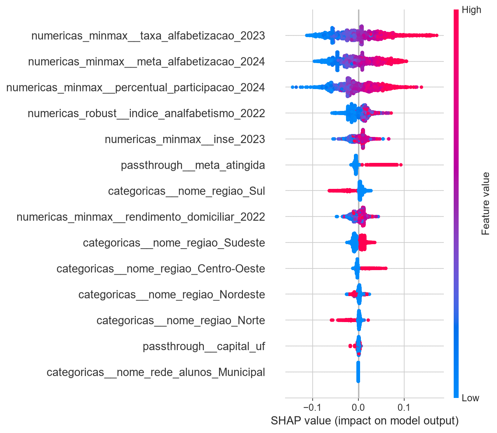

# 📚 Tech Challenge - Fase 3: Predição e Inteligência Analítica para Alfabetização no Brasil


> **Projeto Integrador - Pós-Graduação em Ciência de Dados / Inteligência Artificial**  
> Aplicação prática de pipelines de Machine Learning e Ciência de Dados sobre indicadores socioeconômicos e educacionais brasileiros para predição da alfabetização infantil e apoio a políticas públicas.

---

## 📌 Sumário
- [1. Contexto do Problema](#1-contexto-do-problema)
- [2. Objetivo Analítico](#2-objetivo-analítico)
- [3. Descrição da Base Utilizada](#3-descrição-da-base-utilizada)
- [4. Estrutura do Repositório](#4-estrutura-do-repositório)
- [5. Etapas de Modelagem & Pipeline](#5-etapas-de-modelagem--pipeline)
- [6. Escolha do Algoritmo](#6-escolha-do-algoritmo)
- [7. Métricas de Avaliação](#7-métricas-de-avaliação)
- [8. Interpretação dos Resultados](#8-interpretação-dos-resultados)
- [9. Insights Encontrados](#9-insights-encontrados)
- [10. Limitações do Projeto](#10-limitações-do-projeto)
- [11. Aplicação Prática para Políticas Públicas](#11-aplicação-prática-para-políticas-públicas)
- [12. Possíveis Evoluções Futuras](#12-possíveis-evoluções-futuras)
- [13. Como Executar o Projeto](#13-como-executar-o-projeto)
- [14. Equipe](#14-equipe)

---

## 1. Contexto do Problema
A alfabetização infantil é um dos principais indicadores de desenvolvimento social e educacional de um país. Compreender apenas o panorama histórico ou atual dos dados educacionais não é suficiente para instrumentalizar gestores públicos na tomada de decisões estratégicas. 

Diante de cenários de vulnerabilidade social e disparidades regionais no Brasil, torna-se essencial **antecipar riscos de analfabetismo**, **identificar municípios/regiões vulneráveis** e **compreender quais fatores socioeconômicos e estruturais possuem maior impacto direto no desempenho escolar**. O uso de Inteligência Analítica e Ciência de Dados permite transformar dados públicos esparsos em insights acionáveis para o setor público.

---

## 2. Objetivo Analítico
Desenvolver um **modelo preditivo supervisionado de classificação** capaz de prever se um aluno será considerado **alfabetizado** ou **não alfabetizado**, utilizando uma abordagem preditiva e interpretável.

### Perguntas de Negócio a Responder:
* Quais fatores socioeconômicos, territoriais e educacionais mais impactam a alfabetização infantil?
* Quais municípios e regiões apresentam maior risco de não atingir as metas educacionais?
* Quais regiões possuem padrões semelhantes?
* Como utilizar as predições para orientar a alocação de recursos públicos e direcionamento de políticas educacionais?

---

## 3. Descrição da Base Utilizada
A base analítica do projeto é derivada da plataforma Base de Dados, mais especificamente a tabela do indicador de alfabetização da Pesquisa Alfabetiza Brasil, organizada pelo INEP (https://basedosdados.org/dataset/073a39d4-89cf-4068-b1e8-34ed0d9c0b72?table=e1de7a6a-5038-4e81-89f0-a15f2cc12c9b), enriquecida com dados públicos e territoriais. 

* **Variável Alvo (Target):** `alfabetizado_alunos (1 - Alfabetizado, 0 - Não Alfabetizado)]`
* **Principais Variáveis e Origens:**
  * **Indicadores Educacionais:** taxa_alfabetizacao_2023 - Percentual dos alunos avaliados no município que foram considerados, mediante o resultado da avaliação estadual, como alfabetizados.
  meta_alfabetizacao_2024 - Meta de alfabetização no ano de 2024
  percentual_participacao_2024 - Percentual de participação no município 
  Variáveis extraídas do Indicador Criança Alfabetizada, Metas nacionais, estaduais e municipais (INEP).
  * **Variáveis Socioeconômicas e Populacionais:** Dados demográficos e econômicos territoriais.
  indice_analfabetismo_2022 - Taxa de analfabetismo - pessoas com 15 anos ou mais (Atlas DH - Censo). Fonte: Atlas do Desenvolvimento Humano (Censo Demográfico).
  rendimento_domiciliar_2022 - Rendimento domiciliar per capita médio (SIS/IBGE). Fonte: Síntese de Indicadores Sociais (IBGE).
  inse_2023 - O INSE é o Indicador de Nível Socioeconômico. Ele serve para medir a realidade de renda e escolaridade das famílias dos estudantes brasileiros. Fonte: INEP.
  nome_regiao - Nome da Grande Região Brasileira. Fonte: Diretório ligando diversos códigos institucionais de municípios brasileiros: IBGE, Receita Federal, TSE, BCB, regiões, comarcas, região de saúde, etc.


---

## 4. Estrutura do Repositório
Seguindo os padrões recomendados de organização e modularidade de código:

```text
tech-challenge-fase3/
├── data/                  # Conjuntos de dados (Brutos, Gold e Processados)
├── notebooks/             # Notebooks de EDA e experimentos
├── src/                   # Código-fonte modular da pipeline
│   ├── preprocessing/     # Scripts de limpeza, imputação e encoding
│   ├── modeling/          # Treinamento, otimização e pipelines do Scikit-Learn
│   ├── evaluation/        # Cálculo de métricas, SHAP e feature importance
│   └── visualization/     # Scripts para geração de gráficos e relatórios
├── reports/               # Documentação técnica e relatórios finais
│   └── images/            # Imagens, gráficos e esquemas do projeto
├── .gitattributes         # Regras e comportamentos do repositório Git
├── .gitignore             # Arquivos ignorados pelo Git
├── README.md              # Documentação principal do projeto
└── requirements.txt       # Dependências e bibliotecas do projeto
```

--- 

## 5. Etapas de Modelagem & Pipeline
A pipeline foi construída utilizando a biblioteca **Scikit-Learn**, integrando pré-processamento e estimadores de forma enxuta para evitar **Data Leakage** e garantir reprodutibilidade.

1. **Análise Exploratória de Dados (EDA):**
   * Avaliação de variáveis, identificação de dados nulos e análise de correlação entre variáveis.
   * Formulação de hipóteses analíticas sobre as disparidades regionais.
2. **Pré-processamento:**
   * **Divisão dos Dados:** Separação estrita de conjuntos de Treino e Teste (com estratificação do target).
   * **Variáveis Numéricas:** Imputação de valores nulos e normalização/padronização (`StandardScaler` e `RobustScaler`).
   * **Variáveis Categóricas:** Trancodificação e Encoding (`OneHotEncoder` / `TargetEncoder`).
   * ** Seleção de Features:** Features selecionadas através de testes de correlação Spearman e Person para variáveis numéricas e Teste Qui-Quadrado para variáveis categóricas.
3. **Tratamento de Data Leakage:**
   * O pré-processamento e o ajuste de escala foram aplicados **exclusivamente no conjunto de treino**, evitando contaminação dos dados de teste.
4. **Estratégia de Validação:**
   * diagnósticos de sanidade e interpretabilidade com base na teoria dos jogos cooperativos através da biblioteca **SHAP (SHapley Additive exPlanations)**.

---

## 6. Escolha do Algoritmo
Foram testados e comparados múltiplos algoritmos de classificação.

* **Modelos Avaliados:** `Decision Tree, Random Forest e XGBoost`
* **Modelo Selecionado:** `Random Forest`
* **Justificativa da Escolha:** `Melhor performance global (AUC de 0,673), evidenciando alta capacidade de acerto estratégico.`

---

## 7. Métricas de Avaliação
O projeto avaliou os modelos utilizando métricas alinhadas com o problema de negócios (minimização de Falsos Negativos — identificar corretamente quem precisa de intervenção educacional).

| Modelo | Acurácia | Precisão | Recall | F1-Score | ROC-AUC |
| :--- | :---: | :---: | :---: | :---: | :---: |
| Modelo Baseline | `[0.XX]` | `[0.XX]` | `[0.XX]` | `[0.XX]` | `[0.XX]` |
| Modelo X | `[0.XX]` | `[0.XX]` | `[0.XX]` | `[0.XX]` | `[0.XX]` |
| **Modelo Final (`[Nome]`)** | **`[0.XX]`** | **`[0.XX]`** | **`[0.XX]`** | **`[0.XX]`** | **`[0.XX]`** |

---

## 8. Interpretação dos Resultados
Para garantir a transparência da solução (*Explainable AI - XAI*), foram aplicadas técnicas de interpretabilidade:

* **Feature Importance:** Identificação das variáveis com maior impacto global no modelo.
* **Valores SHAP (SHapley Additive exPlanations):** Análise do impacto positivo ou negativo de cada variável nas predições individuais do modelo.



---

## 9. Insights Encontrados
* **Poder Preditivo do Histórico Recente:** `Indicadores já monitorados (como taxas recentes, metas de alfabetização e percentual de participação) são os preditores mais fortes do desempenho atual, confirmando que os dados existentes oferecem sinal confiável para acompanhamento contínuo.`
* **Validação do Contexto Socioeconômico e Regional:** `Variáveis como região, INSE e rendimento domiciliar capturaram coerentemente as desigualdades regionais históricas (com piores índices associados ao Nordeste e melhores às regiões Sul e Sudeste), validando a aderência do modelo à realidade.`
* **Natureza Multifatorial do Fenômeno:** `Análises de interação (*dependence plots*) demonstraram que o impacto das variáveis é interdependente; metas mais ambiciosas, por exemplo, geram retornos superiores quando combinadas a um contexto socioeconômico mais favorável.`

---

## 10. Limitações do Projeto
* **Disponibilidade Temporal:** `Defasagem temporal de certas bases públicas socioeconômicas (ex: Censo).`
* **Qualidade/Incompletude de Dados:** `Poucos dados relativos aos alunos, o que inviabiliza um modelo mais preciso, já que, dentro do contexto de um município e até mesmo de uma escola, pode existir perfis diferentes de alunos, que ajudaria a explicar melhor o fato de ser ou não alfabetizado. Além disso, há ocorrência de subnotificação ou dados faltantes em determinados municípios menores.`
* **Escopo do Modelo:** `O modelo prevê riscos com base em dados agregados e institucionais, sem considerar fatores subjetivos ou individuais intrapessoais do aluno.`

---

## 11. Aplicação Prática para Políticas Públicas
A solução analítica desenvolvida serve como ferramenta estratégica para gestores públicos educacionais:

* **Priorização de Investimentos:** Direcionamento de verbas do FUNDEB e programas de apoio pedagógico para municípios classificados como de "Alto Risco de Não Alfabetização".
* **Acompanhamento de Metas:** Monitoramento em tempo real de municípios que estão em trajetória de descumprimento das metas do Indicador Criança Alfabetizada.
* **Planos de Ação Territorializados:** Formulação de políticas públicas regionais adaptadas às necessidades socioeconômicas locais identificadas pela análise do SHAP.

---

## 12. Possíveis Evoluções Futuras
* [ ] Implementação de técnicas avançadas para dados desbalanceados (ex: SMOTE, Focal Loss).
* [ ] Desenvolvimento de uma interface gráfica/dashboard interativo (Streamlit ou Power BI) para simulação de cenários por gestores públicos.
* [ ] Deploy do modelo como uma API REST (FastAPI) para consumo por sistemas governamentais.
* [ ] Enriquecimento contínuo da base com novos indicadores socioeconômicos e dados em tempo real.

---

## 13. Como Executar o Projeto

### Pré-requisitos
* Python 3.10 ou superior
* Gerenciador de pacotes `pip` ou `conda`

### Passo a Passo

1. **Clonar o repositório:**
   ```bash
   git clone [https://github.com/SEU-USUARIO/tech-challenge-fase3.git](https://github.com/SEU-USUARIO/tech-challenge-fase3.git)
   cd tech-challenge-fase3
   ```

2. **Criar e ativar o ambiente virtual:**

```Bash
# Linux/macOS
python3 -m venv venv
source venv/bin/activate

# Windows
python -m venv venv
.\venv\Scripts\activate
```

3. **Instalar as dependências:**

```Bash
pip install -r requirements.txt
```

4. **Executar a Pipeline de Modelagem:**

```Bash
python src/modeling/train.py
```
---

## 14. Equipe
Trabalho desenvolvido para o Tech Challenge - Fase 3:

* Igor Paganin - GitHub: https://github.com/paganinigor0807 | LinkedIn: https://www.linkedin.com/in/igor-paganin10

* Leandro Vieira - GitHub: https://github.com/leleandrinho | LinkedIn: https://www.linkedin.com/in/leandrovieira440

* Thiago Baience - GitHub: https://github.com/ThiagoBaia1 | LinkedIn: https://www.linkedin.com/in/thiago-baience-765086146
